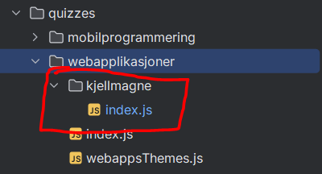
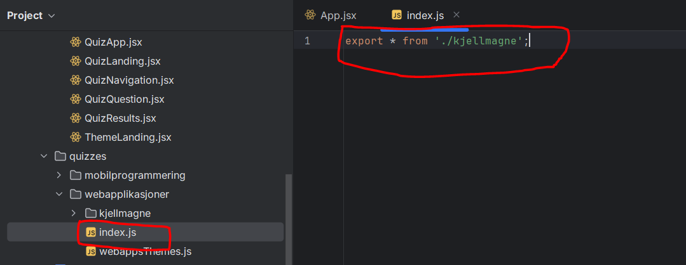
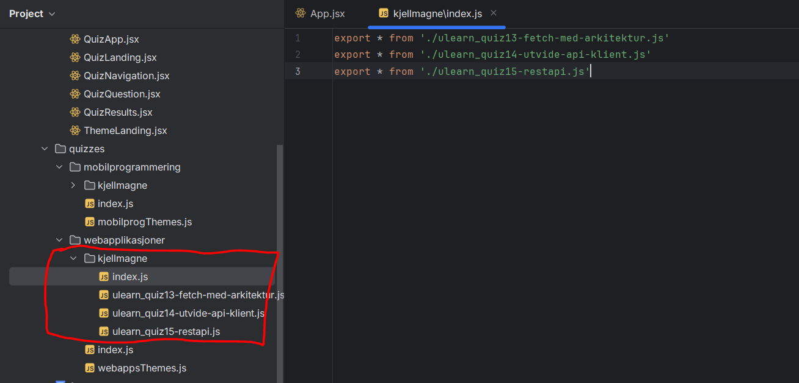
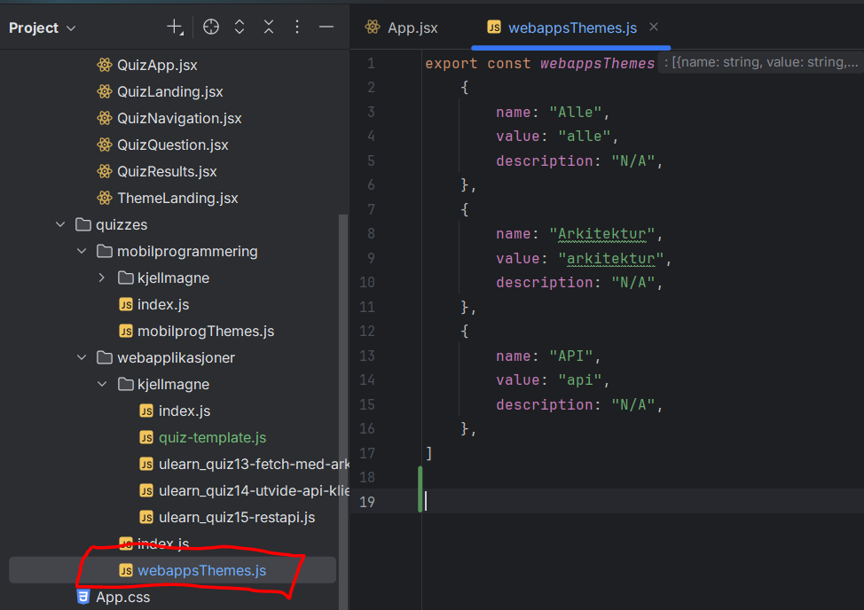

# Quizzy V2

Publisert side: [quizzy-hiof-v2](https://sell-mango.github.io/quizzy-hiof/)

Lag og del fagrelaterte quizzer for hjelp til å pugge til eksamen.

## Installasjon
### krav til å kjøre applikasjonen
1 .NodeJS

---

1. Åpne ny terminal i roten av prosjektet (/quizzy-hiof) og skriv følgende kommando:
```
npm install
```
2. Skriv følgende kommando for å starte applikasjonen:
```
npm run dev
```
---
## Legge til egne quizzer
1. Start med å lage en ny branch, for eksempel quiz/ditt-navn.

2. Start med å lage en mappe i et fag som er relevant for quizzen. Mappen bør være ditt navn (lowercase) og ha en index.js fil.
```
Filsti: src/quizzes/{navn-på-fag}/{ditt-navn(lowercase)/
```


---
3. Importer mappen i Quizzy. I fagets mappe, legg til ****export * from ./dittnavn**** i _index.js_.

---
4. Legg til quizzer. Hver quiz må eksporteres fra din mappe sin index.js fil.

---
5. Kriterier for å lage en quiz:
* Hver quiz er sin unike fil.
* Består av 2 deler: Quiz objekt og Questions objekt.
* Kan være av type multiple choice (4 svar alternativer) eller sann/usann (2 svar alternativer).

6. Koden under kan brukes som utgangspunkt til å lage en quiz. Bruk gjerne KI som ChatGPT, Claude eller Grok til å generere quizzer basert på et relevant tema fra pensum.
```
const questions = [
  {
    id: "q1",
    type: "multiple-choice",
    question: "Spørsmål eller påstand",
    options: [
      "Svar alternativ 1",
        "Svar alternativ 2",
        "Svar alternativ 3",
        "Svar alternativ 4"
    ],
    correct: 1,
    explanation:
      "Forklaring på riktig svar."
  },
  {
    id: "q2",
    type: "true-false",
    question: "Spørsmål eller påstand",
    options: ["Sant", "Usant"],
    correct: 1,
    explanation:
        "Forklaring på riktig svar."
  },
];


export const quiz_name = {
    id: 'quiz-id',
    title: 'Quiz tittel',
    description:
        'Introduksjon av quiz',
    theme: ["tema 1", "tema 2"],
    questions: [
        ...questions
    ]
}

```
---
7. Kategoriser i tema. Hvert fag har en liste med temaer. Sørg for at propertien **theme** matcher minst en eksisterende kategori, eller lag en ny:


8. Test at alt fungerer i din branch, merge deretter til main for å dele quiz med alle:)
